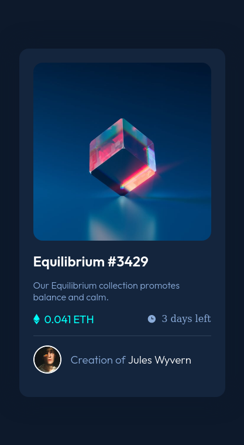
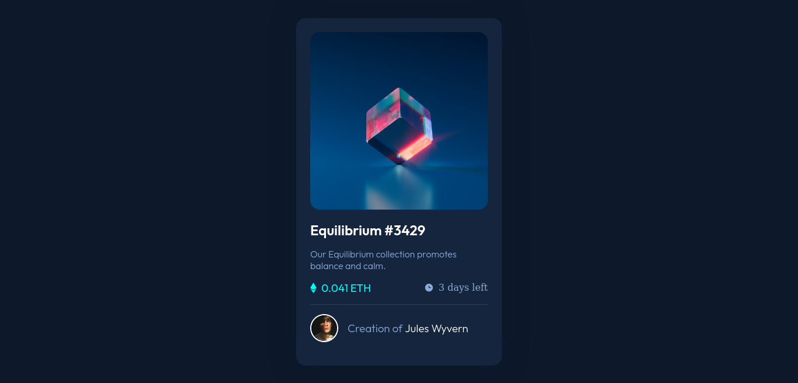

# Frontend Mentor - NFT preview card component solution

This is a solution to the [NFT preview card component challenge on Frontend Mentor](https://www.frontendmentor.io/challenges/nft-preview-card-component-SbdUL_w0U).
## Table of contents

- [Overview](#overview)
  - [The challenge](#the-challenge)
  - [Screenshot](#screenshot)
  - [Links](#links)
- [My process](#my-process)
  - [Built with](#built-with)
  - [What I learned](#what-i-learned)
- [Author](#author)

## Overview

### The challenge

Users should be able to:

- View the optimal layout depending on their device's screen size
- See hover states for interactive elements

### Screenshot

#### Mobile screenshot


#### Desktop screenshot


### Links

- Solution URL: [frontend-mentor](https://github.com/ibrahimisa/nft-preview-card-component-main)
- Live Site URL: [nft-card-component-main.netlify.app](https://nft-card-component-main.netlify.app/)

## My process

### Built with

- SCSS variables
- SCSS partials
- Flexbox
- CSS Grid
- Mobile-first workflow

### What I learned

I learned BEM. using BEM with sass is just 🆒;
*the html*
```html
  <div class="card">
    <p class="card__text">
      Our Equilibrium collection promotes balance and calm.
    </p>
  </div>
```
*the sass*
```scss
  .card{
    &__text{
      // styles
    }
  }
```
Notice how i nest `.&__text` inside `.card` to select `.card__text`.
 
## Author

- Frontend Mentor - [@ibrahimisa](https://www.frontendmentor.io/profile/ibrahimisa)
- Twitter - [@ibrahim_isa274](https://www.twitter.com/ibrahim_isa274)